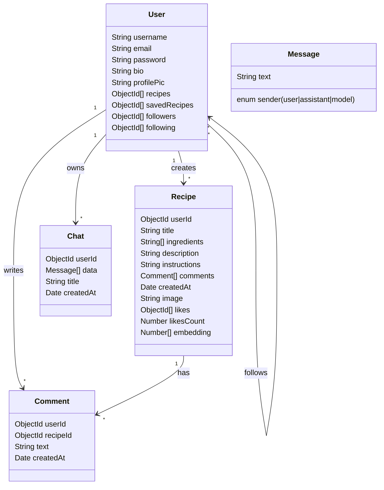
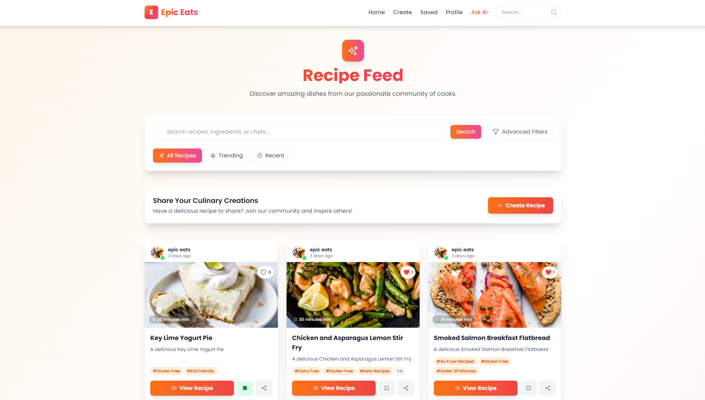
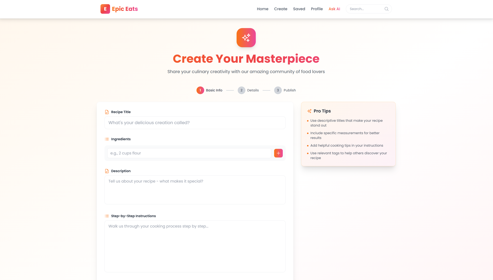
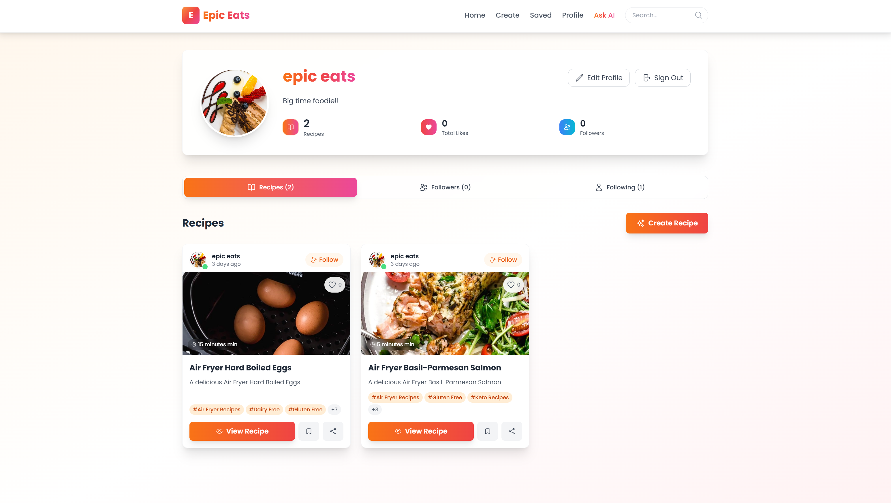
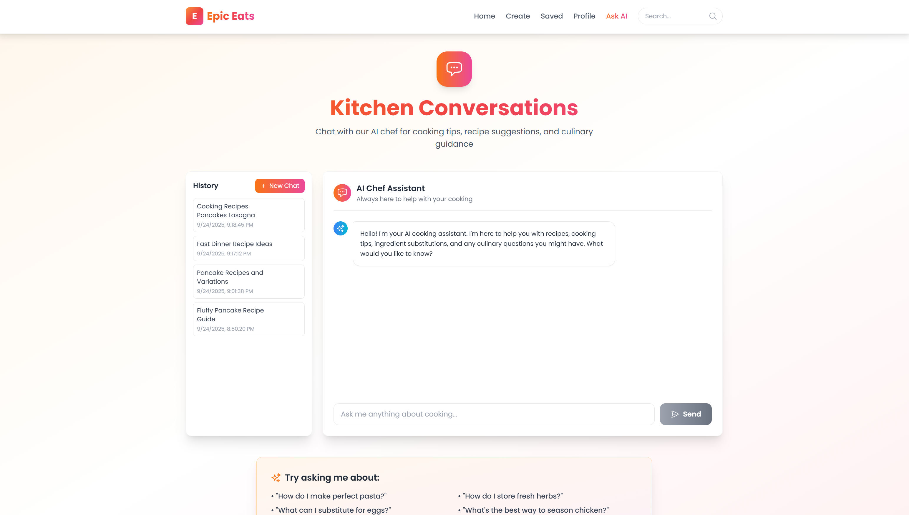

# Epic Eats

Epic Eats is a modern, social recipe-sharing platform built with Next.js 13 (App Router). Discover, create, and share recipes, follow creators, chat with an AI cooking assistant, and personalize your culinary journey.

- Live site: [Epic Eats](https://epic-eats.vercel.app/)

## Features

- **Landing experience**: Polished home page at `/home` with animated hero, feature highlights, testimonials, and clear CTAs.
- **Authentication**: NextAuth-based sessions with redirect logic:
  - Authenticated users are redirected to `/feed` from `/`.
  - Visitors are redirected to `/home` from `/`.
- **Navigation**: Global navbar and footer across the app; navbar is automatically hidden on the landing route `/home`.
- **Feed**: Browse community recipes at `/feed`.
- **Search**: Full-text search at `/search`.
- **Profiles**: Rich profile pages at `/profile/[id]` with:
  - Header section, bio, member since, compact stats (Recipes, Total Likes, Followers)
  - Tabs for Recipes, Followers, and Following
  - Follow/Unfollow actions and counts
- **Recipe creation**: Create new recipes at `/create` with image support (Cloudinary).
- **Save recipes**: Save/bookmark recipes for later at `/saved`.
- **AI Assistant**: Advanced chat at `/chat` with:
  - Retrieval-Augmented Generation (RAG) over recipe/content data
  - Tool calling/actions for tasks like recipe lookup, saving, and more
  - Powered by `@google/genai` (and local models via `@xenova/transformers` where applicable)

## Tech Stack

- **Framework**: Next.js 13.5 (App Router), React 18
- **Auth**: `next-auth`
- **Database**: MongoDB via `mongoose`
- **UI**: Tailwind CSS, Headless UI, Heroicons, Material UI components
- **Media**: Cloudinary (`next-cloudinary`)
- **AI**: `@google/genai`, `@xenova/transformers`; RAG pipeline + tool calling
- **Testing**: Jest, Testing Library

## Project Structure

```
epic-eats/
  src/
    app/
      page.js                # Entry: redirects to /feed or /home
      layout.js              # Root layout with NavBarWrapper and Footer
      home/page.jsx          # Public landing page
      feed/page.jsx          # Main feed
      search/page.jsx        # Search
      create/page.jsx        # Create recipe
      chat/page.jsx          # AI assistant chat
      profile/[id]/page.jsx  # User profile
      recipe/...
      api/...
    components/
      NavBar.jsx
      NavBarWrapper.jsx      # Hides navbar on /home
      HomePage.jsx
      RecipeCard.jsx
      ...
  public/
  package.json
  README.md
```

## Getting Started

### Prerequisites

- Node.js 18+
- A MongoDB connection string
- Cloudinary account (optional but recommended)
- API keys as needed for AI features

### Environment Variables

Create a `.env.local` in the project root with at least:

```
NEXTAUTH_URL=http://localhost:3000
NEXTAUTH_SECRET=your_nextauth_secret
MONGODB_URI=your_mongodb_connection_string

# Cloudinary (if using uploads)
NEXT_PUBLIC_CLOUDINARY_CLOUD_NAME=your_cloud_name
CLOUDINARY_API_KEY=your_key
CLOUDINARY_API_SECRET=your_secret

# Google GenAI
GOOGLE_API_KEY=your_google_genai_api_key
```

### Install and Run

```bash
npm install
npm run dev
```

Visit `http://localhost:3000`. The app will redirect visitors from `/` to `/home`, and signed-in users from `/` to `/feed`.


### Build and Start

```bash
npm run build
npm start
```

## Key UX Behaviors

- **Navbar visibility**: Hidden on `/home` only; visible elsewhere.
- **Profile stats**: Inline within profile header info (no separate status cards).
- **Search**: Top bar search in navbar (desktop + mobile), quick navigation to `/search`.

## Testing

```bash
npm test
```

## Notes for Contributors

- Follow the existing code style and Tailwind utility conventions.
- Prefer server-side data fetching in the App Router where applicable.
- Keep components client-only only when necessary (e.g., `use client`).

## License

This project is for educational use.

## Architecture Overview

- Client: Next.js App Router pages/components; client-only where interactive (e.g., chat, navbar search)
- Server: Next API routes under `src/app/api/*` for auth, recipes, vector ops, and chat tooling
- Data: MongoDB (Mongoose models in `Model/`), Cloudinary for images
- AI: RAG + tool calling orchestrated in chat APIs; `@google/genai` for LLM, `@xenova/transformers` for local embeddings when applicable

## Data Model

High-level Mongoose schemas used by the app:



### AI System (RAG + Tools)

- Ingestion: Recipes and user content embedded; vectors stored and searched via vector API (`src/app/api/recipe/vector/route.js`)
- Retrieval: Top-k relevant chunks retrieved at query time and injected into prompts
- Tool calling: Model can call functions for operations like saving recipes, fetching user data, or searching recipes
- Guardrails: Basic validation and content constraints enforced in API layers

## Deployment

- Recommended: Vercel for Next.js (connect repo, set env vars, deploy)
- Required env vars: see Environment Variables section above

## Screenshots

Place screenshots in `documentation/` and reference them here:








