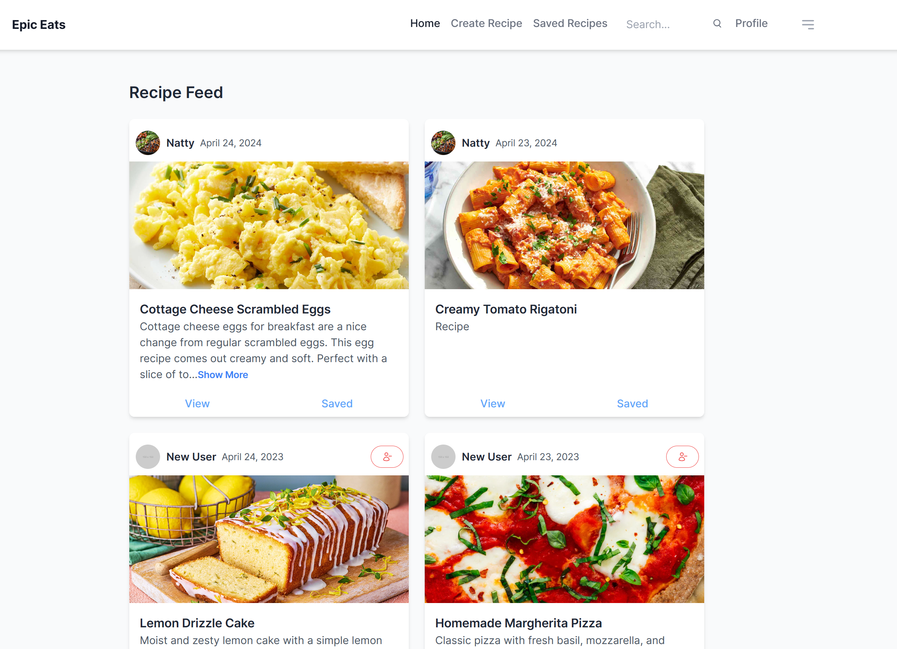
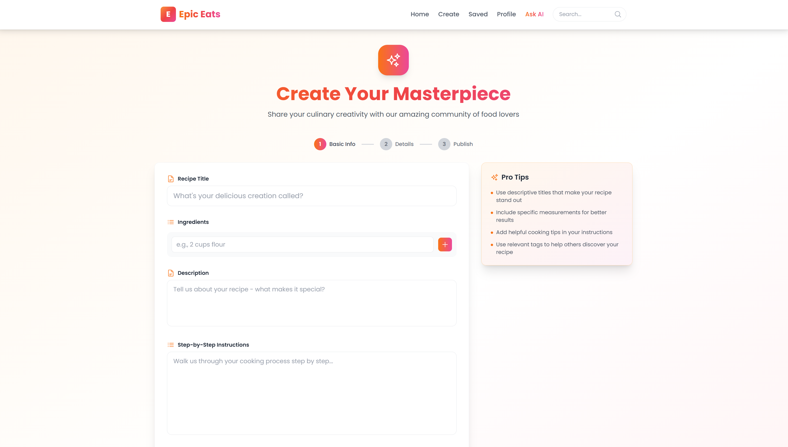
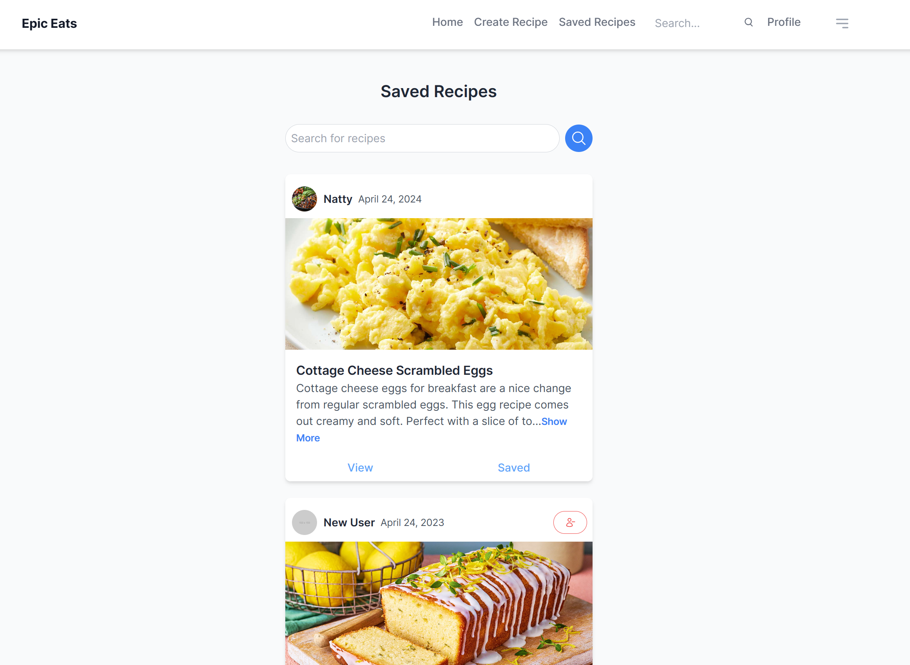
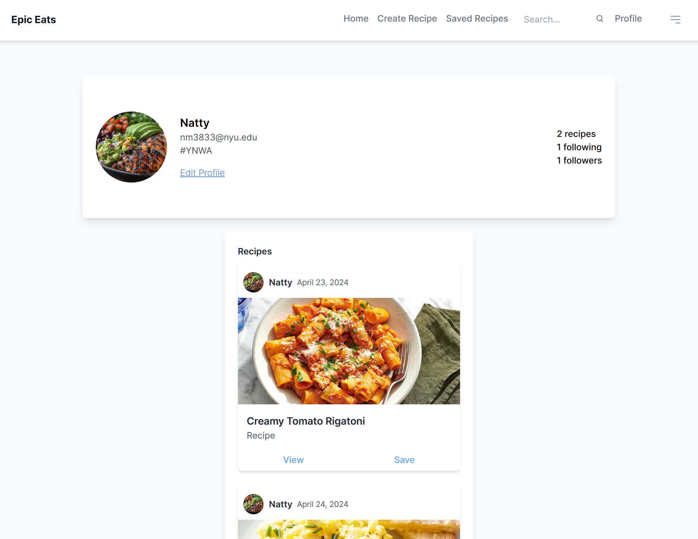
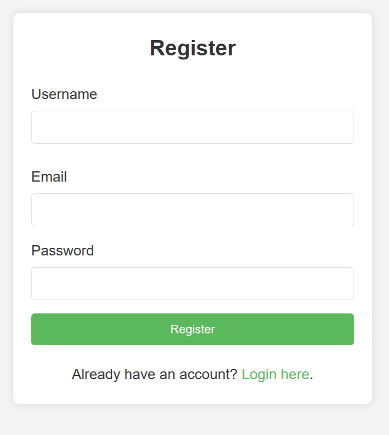
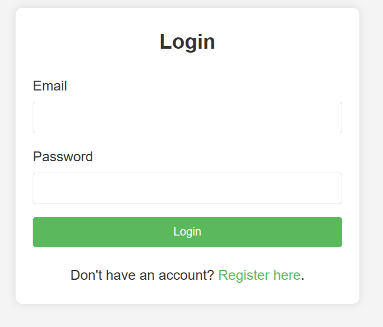
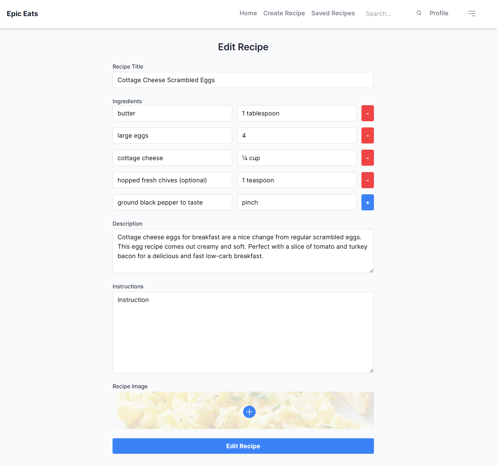
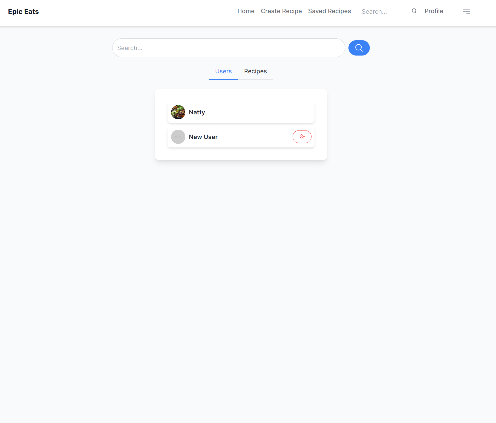

# Epic Eats 

## Overview

Looking for a place to share and discover delightful recepies? Then you are at the right spot.

Introducing Epic Eats, your go-to digital diary for uncovering and sharing the world’s most delightful recipes. Whether you're a seasoned chef or a kitchen newbie, this platform is designed to inspire culinary creativity and bring the joy of cooking to your home.


## Data Model 

The application will store Users, Recepie and Comment.

* A user can have multiple recepies (via references)
* A user can have multiple followers (via references)
* A user can be following multiple users (via references)
* Each recepie can have multiple comments (via references)

An Example User:

```javascript
{
  username: "theCook",
  email: // a unique identifier for the user,
  password: // a password hash,
  recepies: // an array of references to Recepies,
  savedRecepies: // an array of references to Recepies,
  followers: // an array of references to Users,
  following: // an array of references to Users,
  profilePic: // a reference to an Image
}
```

An Example Recepie:

```javascript
{
  userId: // a reference to a User id,
  title: "Chocolate Cake",
  description: "A delicious chocolate cake",
  ingredients: // an array of strings,
  instructions: // a string,
  image: // a reference to an Image,
  comments: // an array of references to Comments
  createdAt: // timestamp
}
```

An Example of Comment:
  
  ```javascript
  {
    userId: // a reference to a User id,
    recipeId: // a reference to a Recepie id,
    text: "This is a great recepie",
    createdAt: // timestamp
  }
  ```

## [Link to Commented First Draft Schema](db.js) 

## Wireframes


/feed



/create - page for creating a new recepie



/saved - page for saved recepies



/profile - page for profile page



/register - page for registering


/login - page for logging in


/recepie - page for viewing a specific recepie


/recipe/edit - page for editing a recepie


/search - page for searching users or recepies



## Site map

[Site Map](documentation/site-map.jpg)

## User Stories or Use Cases


1. as non-registered user, I can register a new account with the site
2. as a user, I can log in to the site
3. as a user, I can create a new recepie
4. as a user, I can view all the recepies
5. as a user, I can view a specific recepie
6. as a user, I can save a recepie
7. as a user, I can view my profile
8. as a user, I can view my saved recepies
9. as a user, I can view my created recepies
10. as a user, I can view my followers
11. as a user, I can view the users I am following
12. as a user, I can follow other users
13. as a user, I can comment on a recepie
14. as a user, I can view all the comments on a recepie
## Research Topics

* (5 points) Integrate user authentication
    * I used next-auth for user authentication and session management
    * i used jwt for token based authentication
    * I'm assigning this 5 points because it's an important part of the project
* (3 points) Perfom validation on the server side
    * I used Joi for validating changes to the database before saving
* (3 points) Use a CSS framework throughout the site
    * I used tailwindcss for styling
* (3 points) External API for image upload
    * I used cloudinary API for image upload
* (5 points) Framework
    * I used Next.js framework to serve both the front end and the backend
* (3 points) API testing
    * I used Jest for testing the API endpoints for the user and recipe routes

22 points total


## [Link to Initial Main Project File](./src/app/page.js)


## Annotations / References Used


1. [next-auth docs](https://next-auth.js.org/getting-started/introduction)
2. [next-auth guide](https://clerk.com/blog/complete-guide-session-management-nextjs)
3. [jsonwebtoken docs](https://jwt.io/) 
4. [cloudinary docs](https://cloudinary.com/documentation/upload_images)
5. [cloudinary tutorial](https://youtu.be/ULp6-UjQA3o?si=5c2mX5SSjfORtKhb)
6. [tailwindcss](https://tailwindcss.com/docs)
7. [joi](https://joi.dev/api/?v=17.12.2)
8. [bcrypt](https://www.npmjs.com/package/bcrypt)
9. [next.js](https://nextjs.org/docs/getting-started)
10. [next.js tutorial](https://youtu.be/NgayZAuTgwM?si=cklGzP7w6V53GBil)
11. [jest](https://jestjs.io/docs/getting-started)
12. [jest for Next](https://nextjs.org/docs/app/building-your-application/testing/jest)
