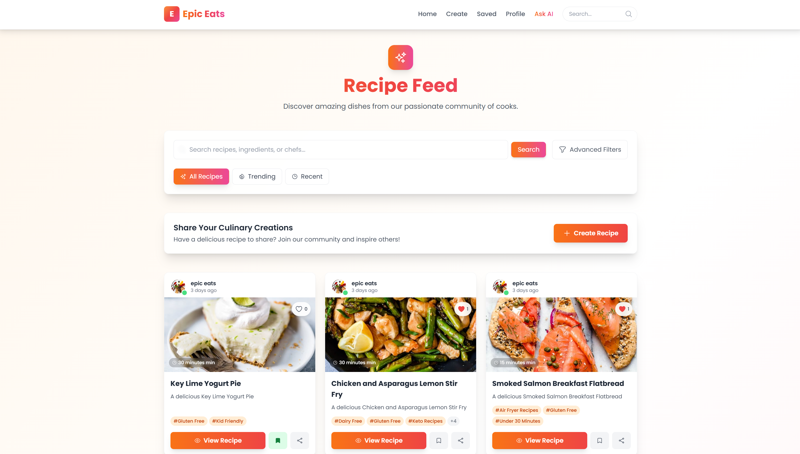
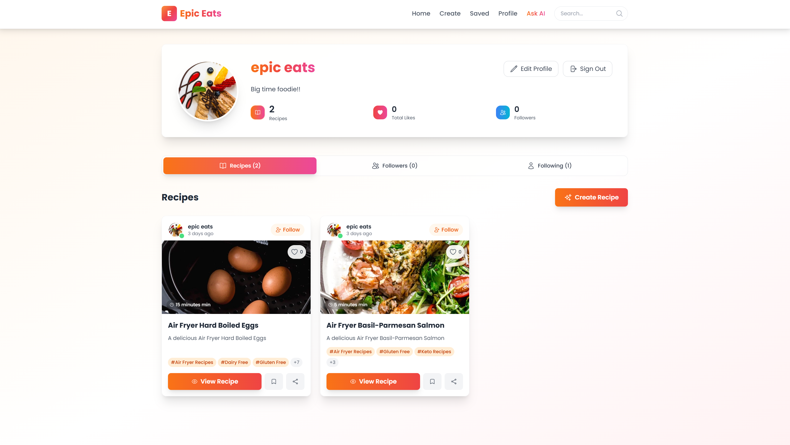

The content below is an example project proposal / requirements document. Replace the text below the lines marked "__TODO__" with details specific to your project. Remove the "TODO" lines.

(___TODO__: your project name_)

# Epic Eats 

## Overview

Looking for a place to share and discover delightful recepies? Then you are at the right spot.

Introducing Epic Eats, your go-to digital diary for uncovering and sharing the world’s most delightful recipes. Whether you're a seasoned chef or a kitchen newbie, this platform is designed to inspire culinary creativity and bring the joy of cooking to your home.


## Data Model 

The application will store Users, Recepie and Comment.

* A user can have multiple recepies (via references)
* A user can have multiple followers (via references)
* A user can be following multiple users (via references)
* Each recepie can have multiple comments (via references)

An Example User:

```javascript
{
  username: "theCook",
  email: // a unique identifier for the user,
  password: // a password hash,
  recepies: // an array of references to Recepies,
  savedRecepies: // an array of references to Recepies,
  followers: // an array of references to Users,
  following: // an array of references to Users,
  profilePic: // a reference to an Image
}
```

An Example Recepie:

```javascript
{
  userId: // a reference to a User id,
  title: "Chocolate Cake",
  description: "A delicious chocolate cake",
  ingredients: // an array of strings,
  instructions: // a string,
  image: // a reference to an Image,
  comments: // an array of references to Comments
  category: // a string
  createdAt: // timestamp
}
```

An Example of Comment:
  
  ```javascript
  {
    userId: // a reference to a User id,
    recipeId: // a reference to a Recepie id,
    text: "This is a great recepie",
    createdAt: // timestamp
  }
  ```

## [Link to Commented First Draft Schema](db.js) 

## Wireframes

(___TODO__: wireframes for all of the pages on your site; they can be as simple as photos of drawings or you can use a tool like Balsamiq, Omnigraffle, etc._)

/feed



/profile/create - page for showing all shopping lists


/profile/saved - page for showing specific shopping list


/profile - page for profile page



/register - page for registering


/login - page for logging in


## Site map

[Site Map](documentation/site-map.jpg)

## User Stories or Use Cases

(___TODO__: write out how your application will be used through [user stories](http://en.wikipedia.org/wiki/User_story#Format) and / or [use cases](https://www.mongodb.com/download-center?jmp=docs&_ga=1.47552679.1838903181.1489282706#previous)_)

1. as non-registered user, I can register a new account with the site
2. as a user, I can log in to the site
3. as a user, I can create a new recepie
4. as a user, I can view all the recepies
5. as a user, I can view a specific recepie
6. as a user, I can save a recepie
7. as a user, I can view my profile
8. as a user, I can view my saved recepies
9. as a user, I can view my created recepies
10. as a user, I can view my followers
11. as a user, I can view the users I am following
12. as a user, I can follow other users
13. as a user, I can comment on a recepie
14. as a user, I can view all the comments on a recepie
15. as a user, I can view all the recepies of a specific category
## Research Topics

(___TODO__: the research topics that you're planning on working on along with their point values... and the total points of research topics listed_)

* (5 points) Integrate user authentication
    * I'm going to be using jason web tokens for user authentication
    * I'm going to hash the passwords using bcrypt
    * I'm assigning this 5 points because it's an important part of the project
* (3 points) Perfom validation on the server side
    * I'll be using Joi for validation
* (3 points) Use a CSS framework throughout the site
    * I'll be using tailwindcss
* (3 points) Body parsing and error handling middleware
    * I'll be using multer for body parsing and express-async-errors for error handling
* (5 points) React
    * I'll be using react for the front end

10 points total out of 8 required points (___TODO__: addtional points will __not__ count for extra credit_)


## [Link to Initial Main Project File](app.js) 

(___TODO__: create a skeleton Express application with a package.json, app.js, views folder, etc. ... and link to your initial app.js_)

## Annotations / References Used

(___TODO__: list any tutorials/references/etc. that you've based your code off of_)

1. [passport.js authentication docs](http://passportjs.org/docs) 
2. [jsonwebtoken docs](https://jwt.io/) 
3. [express-async-errors](https://medium.com/@utkuu/error-handling-in-express-js-and-express-async-errors-package-639c91ba3aa2)
4. [tailwindcss](https://tailwindcss.com/docs)
5. [multer](https://www.npmjs.com/package/multer)
6. [joi](https://joi.dev/api/?v=17.12.2)
7. [bcrypt](https://www.npmjs.com/package/bcrypt)
8. [react](https://reactjs.org/docs/getting-started.html)
